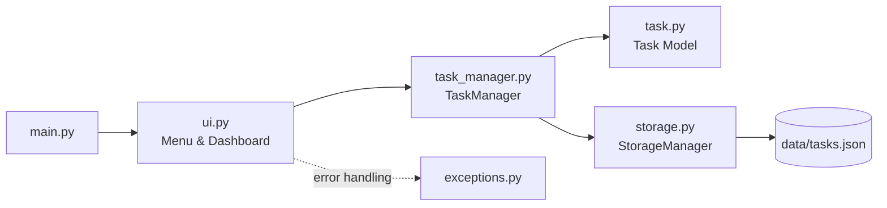

# 📋 TaskFlow CLI

> Aplikasi manajemen tugas (To-Do List) berbasis terminal yang modern, modular, dan scalable — dibangun **100% dengan Python Standard Library**.


---

## 📖 Deskripsi

**TaskFlow CLI** adalah aplikasi manajemen tugas berbasis terminal yang menerapkan praktik software engineering profesional:

- **CRUD** penuh dengan validasi input
- **OOP** dengan pemisahan tanggung jawab yang jelas (`Task`, `TaskManager`, `StorageManager`, `Dashboard`, `Menu`)
- **JSON Database** dengan atomic write & auto-save
- **Exception Handling** berlapis dengan custom exception hierarchy
- **Modular Programming** — setiap layer (model, logic, storage, UI) terpisah
- **Clean Code** — type hint, docstring, PEP8, tanpa duplikasi

## ✨ Fitur

| # | Fitur | Deskripsi |
|---|-------|-----------|
| 1 | ➕ Tambah Task | Judul, deskripsi, kategori, deadline, prioritas (Low/Medium/High) |
| 2 | 📄 Lihat Semua Task | Tabel terminal berwarna dengan indikator terlambat |
| 3 | ✏️ Update Task | Ubah field apa pun, kosongkan untuk skip |
| 4 | 🗑️ Hapus Task | Dengan konfirmasi sebelum menghapus |
| 5 | 🔍 Cari Task | Berdasarkan judul, kategori, prioritas, status |
| 6 | ✅ Tandai Selesai | Status berubah menjadi *Completed* + timestamp |
| 7 | 📊 Statistik | Total, completed, pending, high priority, deadline hari ini |
| 8 | ↕️ Sorting | Deadline, prioritas, tanggal dibuat |
| 9 | 🧮 Filter | Kategori, status, prioritas |
| 10 | 💾 Backup | Backup JSON otomatis ke folder `backup/` |
| 11 | ♻️ Restore | Pilih & pulihkan file backup |
| 12 | 📤 Export | CSV dan TXT ke folder `exports/` |
| 13 | 🖥️ Dashboard | Statistik live, jam, progress bar, notifikasi deadline |

### Bonus
- 🎨 Banner ASCII modern & warna terminal ANSI
- ⏳ Loading animation (spinner)
- 📈 Progress bar penyelesaian task
- 🔔 Notifikasi deadline hari ini & task terlambat
- 🕒 Timestamp otomatis (`created_at`, `updated_at`, `completed_at`)
- 💾 Auto-save pada setiap perubahan

## 🖥️ Preview Terminal

```text
 _____         _    _____ _
|_   _|_ _ ___| | _|  ___| | _____      __
  | |/ _` / __| |/ /| |_  | |/ _ \ \ /\ / /
  | | (_| \__ \   < |  _| | | (_) \ V  V /
  |_|\__,_|___/_|\_\|_|   |_|\___/ \_/\_/  CLI

=====================================================
  Waktu Sekarang   : Wednesday, 08 July 2026 09:41:00
  Total Task       : 8
  Completed        : 5
  Pending          : 3
  Deadline Hari Ini: 1
  Progress         : [██████████████████░░░░░░░░░░░░] 62.5%
=====================================================
  [DEADLINE HARI INI] #4 Kerjakan laporan praktikum
=====================================================
  1. Dashboard
  2. Task
  3. Statistics
  4. Backup
  5. Export
  0. Exit
=====================================================
Pilih menu:
```

> 🖼️ *Screenshot placeholder — tambahkan screenshot aplikasi Anda di sini:*
>
> 
> 

## 📁 Struktur Folder

```text
taskflow-cli/
│
├── main.py              # Entry point (tipis, hanya bootstrap)
├── task.py              # Model: Task dataclass, Priority & Status enum
├── task_manager.py      # Business logic: CRUD, search, sort, statistik
├── storage.py           # Persistence: JSON DB, backup, restore, export
├── ui.py                # Presentation: Dashboard, Menu, ANSI, animasi
├── exceptions.py        # Custom exception hierarchy
├── data/
│   └── tasks.json       # JSON database
├── tests/
│   └── test_task_manager.py  # 22 unit test (unittest)
├── README.md
├── requirements.txt     # Kosong — tanpa dependensi eksternal
└── .gitignore
```

## 🏗️ Arsitektur



## ⚙️ Instalasi

**Prasyarat:** Python 3.12 atau lebih baru. Tidak ada dependensi eksternal.

```bash
# 1. Clone repository
git clone https://github.com/<username>/taskflow-cli.git

# 2. Masuk ke folder proyek
cd taskflow-cli
```

## 🚀 Cara Menjalankan

```bash
python main.py
```

Menjalankan unit test:

```bash
python -m unittest discover -s tests -v
```

## 💡 Contoh Penggunaan

1. Pilih menu `2. Task` → `1. Tambah Task`
2. Isi data:

```text
Judul       : Belajar Python
Deskripsi   : Function dan OOP
Kategori    : Study
Deadline (YYYY-MM-DD): 2026-08-10
Prioritas (Low/Medium/High): High
[OK] Task #1 'Belajar Python' berhasil ditambahkan.
```

3. Data otomatis tersimpan di `data/tasks.json`:

```json
[
  {
    "id": 1,
    "title": "Belajar Python",
    "description": "Function dan OOP",
    "category": "Study",
    "priority": "High",
    "deadline": "2026-08-10",
    "status": "Pending",
    "created_at": "2026-07-08 09:41"
  }
]
```

## 🗺️ Roadmap

- [x] CRUD task dengan validasi penuh
- [x] JSON database + atomic write
- [x] Backup, restore, export CSV/TXT
- [x] Dashboard dengan statistik & progress bar
- [x] 22 unit test dengan `unittest`
- [ ] Sub-task & task berulang (recurring)
- [ ] Reminder berbasis waktu
- [ ] Konfigurasi tema warna

## 🔮 Future Improvement

- Migrasi opsional ke SQLite untuk dataset besar
- Argumen CLI (`argparse`) untuk mode non-interaktif, mis. `python main.py add "Judul"`
- Export ke Markdown & JSON terformat
- Sinkronisasi cloud (Google Drive / Dropbox API)
- Text User Interface penuh dengan `curses`
- Integrasi CI (GitHub Actions) untuk menjalankan test otomatis

## 🎓 Skill yang Dipelajari

- **OOP**: dataclass, enum, encapsulation, dependency injection
- **Persistence**: JSON serialization, atomic file write, backup strategy
- **Error Handling**: custom exception hierarchy, exception chaining (`raise ... from`)
- **Clean Code**: type hints (PEP 484), docstrings (PEP 257), PEP8, single responsibility
- **Testing**: `unittest`, `TemporaryDirectory`, test isolation, edge case coverage
- **CLI UX**: ANSI escape codes, spinner animation, progress bar, table rendering

## 📄 Lisensi

MIT License — bebas digunakan untuk belajar dan pengembangan.

---

⭐ *Jika proyek ini membantu, berikan star di GitHub!*
